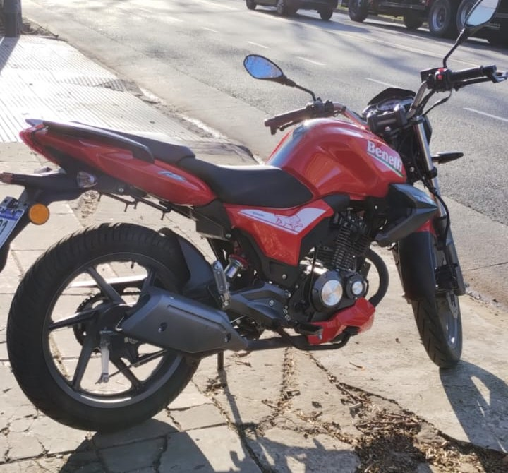
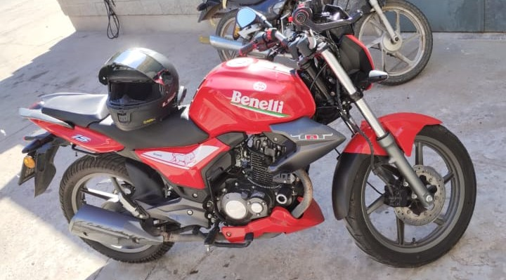
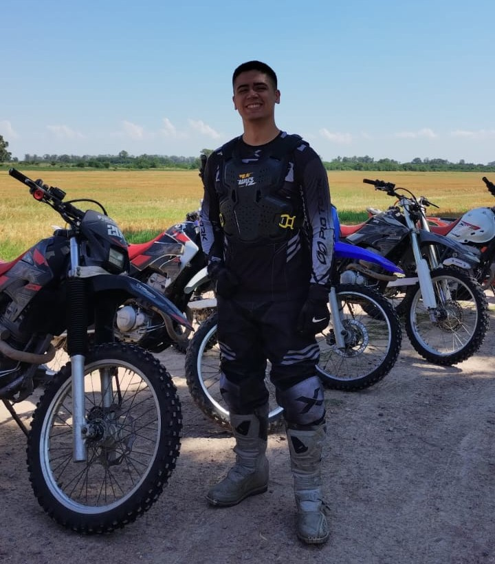
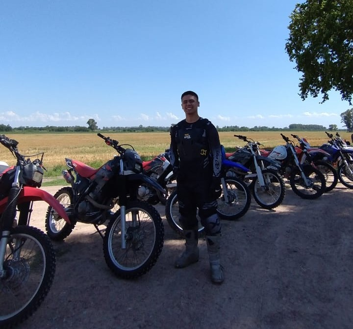

# PRESENTACION : Palacio Pablo

 
>Buenas, soy Pablo.

>Laburo como analista en una clínica y estoy metiéndole a la ciberseguridad, pero a mi manera… laburo, estudio y voy armando todo de a poco.

>Fuera de eso, lo que más me gusta son las motos. Tengo una Benelli 150 y ya estoy viendo de subir a algo más grande, tipo una 250, una CB300 o una Dominar 400.

>También hice enduro, así que me gusta meterme en lo complicado, no solo andar tranqui.

>Tuve varios accidentes… cuatro en total. El último fue heavy: me quebré el Codo en tres partes y la Muñeca en cuatro. Pero por suerte se curó sin operación, con todos los cuidados.

>Y nada… eso no me frena. Al contrario.

>Sigo dándole, aprendiendo y avanzando a mi ritmo.

>Mi legajo es 175.324-1.

>Adjunto foto de mi y motocicleta.

#Moto 

#Yo 

>La motocicleta que se ve en IMAGEN es la HONDA XR250 . Hermosa expericia para enduro esa moto.
